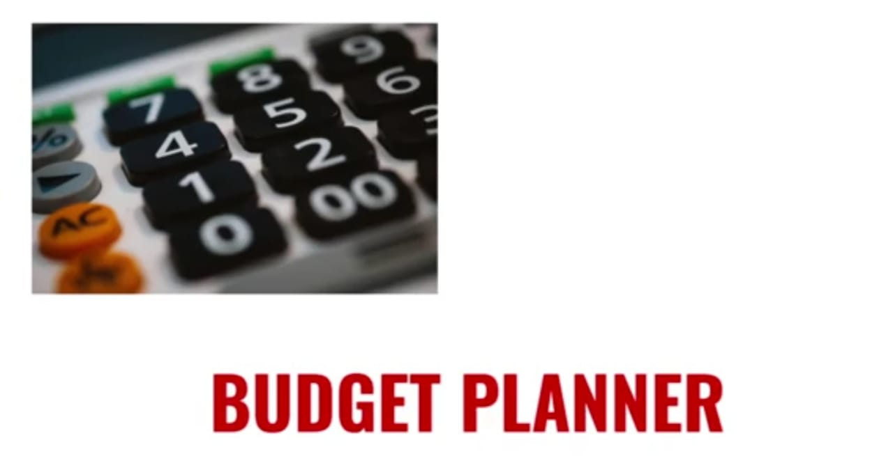

  
 

 <h2> <i> The motive of the application is to take control of users' finances within minutes and enable the peace of mind of the user by not getting tensed on his financial burdens. User can create a custom monthly budget to save money, Manage money, track spending, to achieve your financial goals and also get a reminder at the same time, this application is an all in one place for a tension free financial freedom. </h2>

 

 

## Tech Stack  
### Python     

   

# Screenshots
## Input Screen 
    
## Output Screen
   
   
   
  

### Give It a Star if you liked the project 
